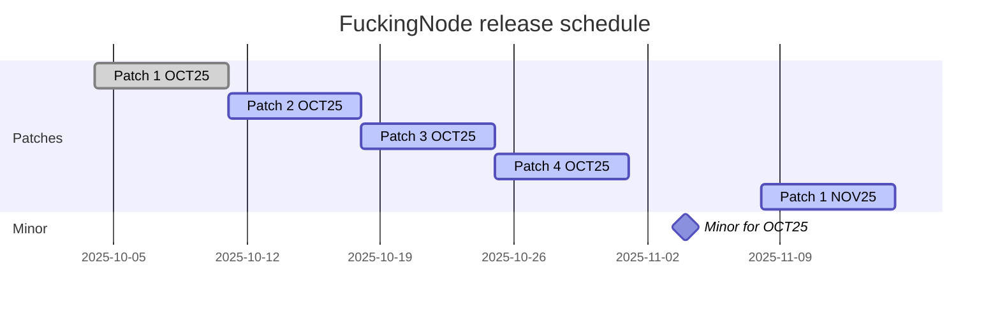

# FuckingNode release schedule

This document describes how FuckingNode schedules releases. We want releases to be predictable and be somewhat consistent.

---

## Release types and frequency

Types are as in SemVer.

| Type      | Frequency                                                                                          | Includes                                                                                                     |
| :-------- | :------------------------------------------------------------------------------------------------- | :----------------------------------------------------------------------------------------------------------- |
| **Patch** | Every month's 1st, 2nd, and 3rd saturday.                                                          | Only fixes and performance improvements. No behavioral changes (unless explicitly required to fix an issue). |
| **Minor** | Every month's last friday. If a patch was immediately needed, it'd follow on sunday, not saturday. | New features or non-breaking features. Behavioral changes or "unnoticeably breaking" changes may happen.     |
| **Major** | Unscheduled.                                                                                       | Big, breaking changes.                                                                                       |

We define "unnoticeably breaking" changes as changes that are _breaking by definition_ but not _breaking in practice_. For example, changing a fixed or "predictable" form of output (like cleanup report or an error code) is _breaking by definition_ (as, for example, if someone had a tool that captures FuckingNode's output for whatever purpose, said changes would break compatibility), however in practice these changes are small enough to be considered "unnoticeable".

Whether a change is small enough or not to fit within this definition is determined purely by our own criteria.

> [!IMPORTANT]
> **TL;DR: _if there's nothing to ship when a release day arrives, we skip it rather than make an empty release._**
>
> Releases are made _under demand only_. This means, if there's no issue found with the CLI and a patch saturday arrives, no patch is released. Releases are not considered overdue when this happens, so if a issue was found on sunday, its corresponding patch is the next saturday's one, not an "overdue past saturday's" one that would come out immediately. Same principle applies to minor releases.
>
> If the date of a minor release arrives and there's just patch-only changes ready to be shipped, then the minor release is skipped _but the patch isn't_, releasing said patch-only release on a sunday, as you'd expect from this schedule.

## Schedule diagram

On a diagram, our schedule look like this.

